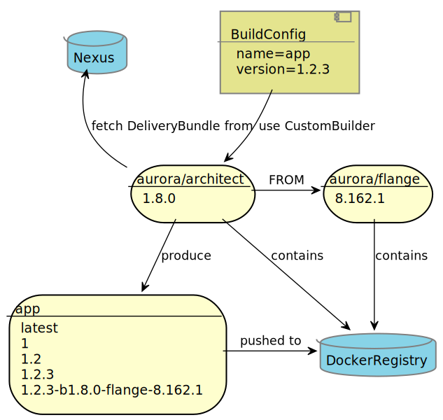
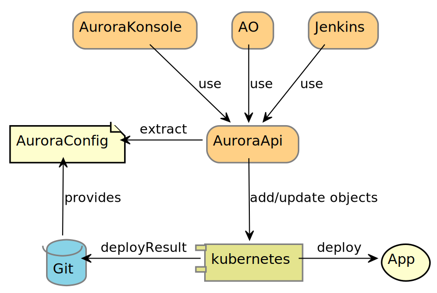
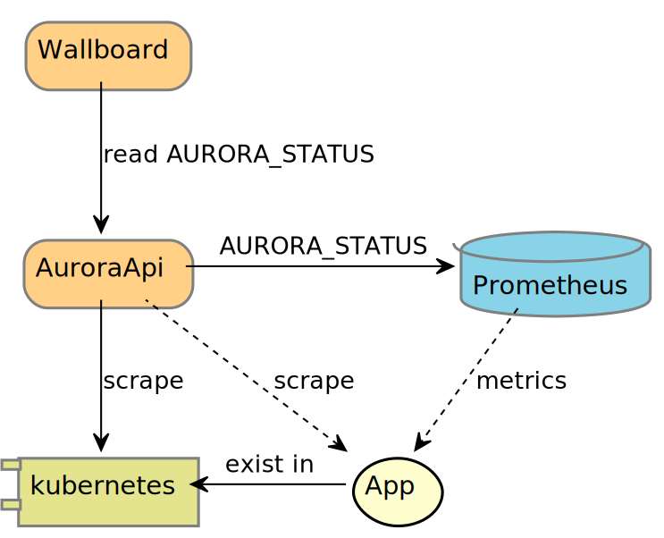

## Faster development and more efficient ops

- [PaaS](https://en.wikipedia.org/wiki/Platform_as_a_service) built upon [OpenShift](http://www.openshift.com)
- At the core of the platform is our custom declarative config format AuroraConfig and the [AuroraAPI](/documentation/openshift/#the-aurora-api).
- The AuroraAPI supports deploying applications and observing their status while running.
- Applications are built in a common Jenkins CI/CD pipeline, supported by a [CustomBuilder](https://docs.openshift.com/container-platform/4.12/cicd/builds/build-strategies.html#builds-strategy-custom-build_build-strategies-s2i) called [Architect](/documentation/openshift/#the-application-image-builder-architect).

## Why did you make things in-house?

- We have many different development teams that work on our clusters and we want them to be able to work in **isolation**. Both Kubernetes and OpenShift lack support for groups of users that can adminster subsets of cluster objects. We have created a concept called **affiliation** to support this.

- The ability to deploy applications to **several clusters** in one command is highly desired within our organization. Our network infrastructure implies that we need to have multiple clusters.

- When configuring how to deploy applications and projects we want to avoid duplication. Our **declarative** config format AuroraConfig supports **composition** with **sane defaults**.

> In order to avoid 'wall-of-yaml' we use a declarative, composable configuration format with sane defaults that is transformed into Kubernets objects
>
> **Bjarte Karlsen, Technical Architect NTA**

## How we build

Applications are built, tested and verified in our custom Jenkins CI/CD pipeline. They are then passed on to the proprietary CustomBuilder, Architect, as zip files called DeliveryBundles. A DeliveryBundle contains the application files and metadata.

Builds are triggered in one of several ways;

- via the CI/CD pipeline from commits tagged as [semanic releases](/documentation/openshift/#deployment-and-patching-strategy) or as feature branch SNAPSHOTS.
- as a binary-build directly from a development machine. This will buypass Jenkins and read the DeliveryBundle from stdin.
- from ImageChange triggers when either the CustomBuilder or the Base Image changes. See our [patching strategy](/documentation/openshift/#deployment-and-patching-strategy).

## How we deploy

A deploy starts in the AuroraAPI, triggered from one of the user facing clients ([AO](/documentation/openshift/#ao) and [Aurora Konsoll](/documentation/openshift/#aurora-konsoll)), or automatically from the build pipeline. The API extracts and merges relevant parts of the specified AuroraConfig in order to create an AuroraDeploymentSpec for the application being deployed.

From the AuroraDeploymentSpec we provision resources in our existing infrastructure and generate OpenShift objects that are applied to the cluster. The application is then rolled out either via importing a new image or triggering a new deploy. The deploy result is saved for later inspection.

## Observe what is running

We augment the application status data that OpenShift already keeps by regularly inspecting the master API and the management interface (part of our runtime contract) of the applications. The extra status data collected is compiled into a separate status value called [AuroraStatus](/documentation/openshift/#application-monitoring). This allow us, among other things, to create custom wallboards, alert integrations, rate of errors and 95% percentile response times.

